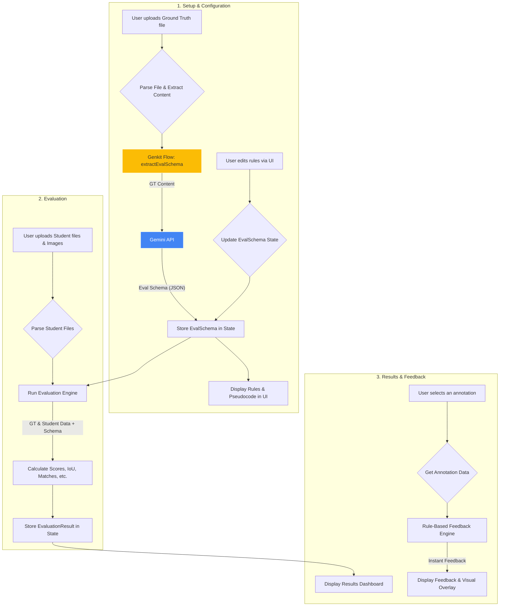

# Annotator AI

A powerful, in-browser tool for evaluating image annotations with detailed, AI-driven, and rule-based feedback.

## ✨ Features

*   **Batch Evaluation**: Upload and evaluate multiple student annotation files at once against a single ground truth.
*   **Multiple Annotation Formats**: Supports bounding boxes, polygons, and skeletons.
*   **Rich Data Formats**: Works with popular annotation formats like COCO (JSON) and CVAT (XML).
*   **Comprehensive Scoring**: Calculates scores based on a weighted average of Intersection over Union (IoU), Object Keypoint Similarity (OKS), label accuracy, and attribute similarity.
*   **Visual Feedback**: An interactive viewer displays ground truth and student annotations side-by-side on the original images.
*   **Instant Rule-Based Feedback**: Get immediate, deterministic feedback on annotation geometry (gaps, cut-offs).
*   **AI-Enhanced Analysis**: Utilizes Google's Gemini models to generate human-like feedback and extract complex evaluation schemas directly from annotation files.
*   **Customizable Evaluation Logic**: Users can modify the evaluation rules using plain English instructions or by directly editing pseudocode.

## 🏛️ Architecture Overview

Annotator AI is a standalone **in-browser application** built with Next.js and React. There is no backend server; all processing, parsing, and evaluation happens directly on the client-side. This design ensures user data privacy and eliminates server costs.

**Workflow:**

1.  **File Upload**: The user uploads a ground truth (GT) annotation file (JSON, XML, or a ZIP containing annotations and images).
2.  **Schema Extraction (AI)**: The GT file's content is sent to a Genkit flow running Google's Gemini model. The model analyzes the file's structure and returns a structured **Evaluation Schema**, including labels, attributes, a potential matching key, and human-readable pseudocode representing the evaluation logic.
3.  **Rule Configuration**: The user can review the generated schema and pseudocode. They have the option to modify the evaluation logic by either providing new plain-text instructions or editing the pseudocode directly.
4.  **Student Evaluation**: The user uploads one or more student annotation files. The application then uses the configured schema and a rule-based evaluation engine (`evaluator.ts`) to compare each student's work against the ground truth.
5.  **Results Display**: The final scores, feedback, and a detailed breakdown are displayed in the results dashboard. All annotation comparisons can be inspected visually.
6.  **Feedback Generation**: When an annotation is selected for inspection, a fast, rule-based engine calculates geometric discrepancies (gaps/cut-offs) and provides instant feedback.

## 📊 Data Flow Diagram

This diagram illustrates the complete data flow within the browser.



## ⚙️ Installation

To run this project locally, you will need Node.js and npm installed.

1.  **Clone the repository:**
    ```bash
    git clone <your-repository-url>
    cd <repository-directory>
    ```

2.  **Install dependencies:**
    ```bash
    npm install
    ```

3.  **Set up environment variables:**
    Create a `.env` file in the root of the project by copying the example:
    ```bash
    cp .env.example .env
    ```
    Open the `.env` file and add your Google AI API key:
    ```
    GEMINI_API_KEY=your_google_ai_api_key_here
    ```

4.  **Run the development server:**
    ```bash
    npm run dev
    ```
    The application will be available at `http://localhost:9002`.

## 🚀 Usage Examples

1.  **Launch the application** by following the installation guide.
2.  **Select an Evaluation Mode**: Choose between Bounding Box, Skeleton, or Polygon.
3.  **Upload Ground Truth**: In the "Ground Truth Annotations" section, upload your expert-reviewed annotation file. This can be a COCO JSON file, a CVAT XML file, or a ZIP archive containing the annotation file and all corresponding images.
4.  **Configure Rules**: Wait for the AI to generate the evaluation rules. Once loaded, inspect the "Evaluation Rules" card. You can either edit the pseudocode directly or provide plain-text instructions to modify the logic, then click "Regenerate Rules".
5.  **Upload Student Files**: In the "Student Annotations" section, upload one or more student submission files (or a single ZIP containing them).
6.  **Run Evaluation**: Click the "Run Evaluation" button.
7.  **Review Results**: The dashboard will populate with a batch summary and detailed breakdowns for each student. Click on any row or accordion to inspect results per image and get feedback on individual annotations.


## 🔧 Configuration

The primary configuration is done via an environment variable.

| Variable        | Description                                                                                             | Default |
| --------------- | ------------------------------------------------------------------------------------------------------- | ------- |
| `GEMINI_API_KEY`| **Required.** Your API key for Google AI Studio to power the schema extraction and AI feedback features. | `null`  |

## 🗺️ Roadmap

*   [ ] **Advanced Skeleton Evaluation**: Add support for custom keypoint sigmas and connection templates.
*   [ ] **Project History**: Save and load previous evaluation sessions from local storage.
*   [ ] **Configuration Export/Import**: Allow users to save and load their customized evaluation rule schemas.
*   [ ] **Enhanced Visualization**: Implement more detailed feedback visualization options, such as heatmaps for polygon deviation.
*   [ ] **CI/CD**: Add GitHub Actions for automated testing and linting.

## 🤝 Contributing

Contributions are welcome! Please follow these steps to contribute:

1.  **Fork the repository.**
2.  **Create a new branch** for your feature or bug fix:
    ```bash
    git checkout -b feature/your-feature-name
    ```
3.  **Make your changes.** Ensure your code adheres to the existing style.
4.  **Commit your changes** with a clear and descriptive commit message.
5.  **Push to your branch:**
    ```bash
    git push origin feature/your-feature-name
    ```
6.  **Open a Pull Request** against the `main` branch of the original repository.

Please ensure your PR includes a clear description of the problem and solution, and reference any relevant issues.

## 📄 License

This project is licensed under the **Apache-2.0 License**. See the `LICENSE` file for details.

## 📞 Contact & Support

*   **Issues**: If you encounter a bug or have a feature request, please [open an issue](https://github.com/your-username/your-repo/issues) on GitHub.
*   **Questions**: For general questions or discussions, please use the [GitHub Discussions](https://github.com/your-username/your-repo/discussions) tab.
