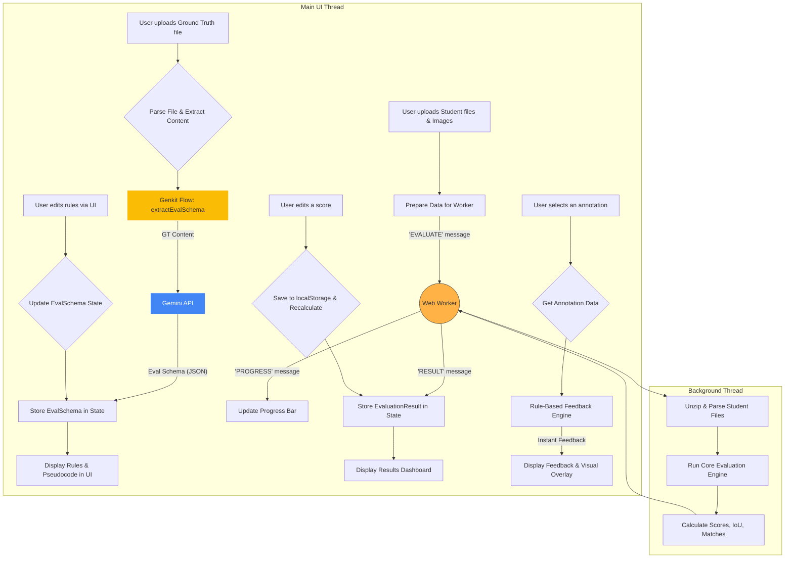

# Annotator AI: Intelligent Image Annotation Evaluation

A powerful, in-browser tool for evaluating image annotations with detailed, AI-driven, and rule-based feedback.

## ✨ Features

Annotator AI provides a robust suite of features designed to make the evaluation of image annotation quality fast, accurate, and insightful.

*   **⚡ High-Performance Processing**: Utilizes **Web Workers** to run all heavy-duty file parsing and evaluation in the background. This ensures the user interface remains 100% responsive, even when evaluating hundreds of files in a single batch.
*   **✍️ Editable Scores**: Trainers can override the automated score for any matched annotation. The overall evaluation results and feedback update instantly. Overrides are persisted in the browser's local storage and included in detailed CSV reports.
*   **📊 Batch Evaluation**: Seamlessly upload and evaluate multiple student annotation files at once against a single ground truth file. The tool is optimized for workflows common in academic settings and data labeling quality assurance.
*   **🧩 Multiple Annotation Formats**: Native support for various annotation types to cover diverse use cases:
    *   **Bounding Boxes**: For object detection tasks.
    *   **Polygons**: For precise segmentation tasks.
    *   **Skeletons/Keypoints**: For pose estimation and landmark detection.
*   **📂 Rich Data Format Support**: Works with the most popular annotation formats in the computer vision ecosystem, ensuring easy integration with your existing tools:
    *   **COCO (JSON)**: The industry standard for object detection and segmentation datasets.
    *   **CVAT (XML 1.1)**: A widely used format from the popular CVAT annotation tool.
    *   **ZIP Archives**: For convenience, upload a single ZIP file containing both the annotation file (`.json` or `.xml`) and all associated images. The tool will automatically parse the contents.
*   **💯 Comprehensive Scoring Engine**: Go beyond simple IoU. The tool calculates a holistic score based on a weighted average of multiple critical metrics:
    *   **Localization Accuracy (IoU/OKS)**: Measures the overlap for bounding boxes (Intersection over Union) or keypoint similarity for skeletons (Object Keypoint Similarity).
    *   **Label Accuracy**: Checks if the object class assigned by the student matches the ground truth.
    *   **Attribute Similarity**: Compares the values of custom attributes (e.g., 'color', 'occluded') using Levenshtein distance for robust text comparison.
    *   **Precision & Recall**: Identifies and penalizes for missed (false negatives) and extra (false positives) annotations.
*   **🖼️ Interactive Visual Feedback**: A core feature is the side-by-side visual comparison tool.
    *   View ground truth and student annotations overlaid on the original image.
    *   Click on any annotation in the results table to instantly highlight it in the viewer.
    *   Toggle visibility for different annotation types (Matched, Missed, Extra) to reduce clutter and focus on specific errors.
    *   Zoom and pan capabilities allow for close inspection of annotation boundaries.
*   **⚡️ Instant Rule-Based Feedback**: Get immediate, deterministic feedback on annotation geometry.
    *   When a bounding box is selected, a high-speed, non-AI engine instantly calculates geometric discrepancies.
    *   Identifies and visualizes `gaps` (where the student box is too small) and `cut-offs` (where the student box is too large) on each of the four edges.
    *   Provides clear, templated messages for each geometric error.
*   **🤖 AI-Enhanced Schema Extraction**: The tool uses Google's Gemini models to intelligently understand your data.
    *   On uploading a ground truth file, the tool sends its content to a Genkit flow.
    *   The AI analyzes the file's structure and returns a structured **Evaluation Schema**, including all labels, their associated attributes, and a potential matching key.
    *   It also generates human-readable pseudocode that represents the derived evaluation logic.
*   **✍️ Customizable Evaluation Logic**: Take control of the evaluation process.
    *   Directly edit the AI-generated pseudocode to fine-tune the evaluation logic (e.g., change weights, add custom checks).
    *   Provide plain English instructions (e.g., "ignore the 'color' attribute") and the AI will regenerate both the structured schema and the pseudocode to match your request.

## 🏛️ Architecture Overview

Annotator AI is currently architected as a **standalone in-browser application**. This serverless design was chosen to maximize user privacy (no data ever leaves your machine) and eliminate hosting costs. 

To handle intensive computations without freezing the user interface, the application leverages a **Web Worker**. All heavy tasks—such as unzipping files, parsing large annotation data, and running the evaluation algorithms—are offloaded to this background thread. The main UI thread is responsible only for rendering the interface and managing user interactions, ensuring a smooth and responsive experience even with large datasets. While this approach is ideal for smaller datasets and getting started quickly, please see our architectural roadmap for plans to support larger-scale evaluations via a backend server.

### Core Workflow:

1.  **File Upload & Parsing**: The user begins by uploading a ground truth (GT) annotation file. This can be a COCO JSON, a CVAT XML, or a ZIP archive containing annotations and images. The application uses client-side JavaScript libraries (`JSZip`, `DOMParser`) to read and parse these files directly in the browser. All image data is converted to local blob URLs for rendering.
2.  **AI Schema Extraction**: The text content of the GT file is passed to a `Genkit` flow. This flow communicates with the Gemini API, which analyzes the structure and content of the annotations. The model's task is to identify all unique object labels, their associated attributes (e.g., "color," "occlusion"), and a potential unique identifier (`matchKey`) that can be used to pair annotations. It returns this information as a structured JSON object called `EvalSchema`.
3.  **Rule Configuration**: The `EvalSchema` is stored in the React component's state. The UI then displays the extracted labels, attributes, and a human-readable pseudocode representation of the evaluation logic. The user can review this logic and choose to modify it by either providing new plain-text instructions or by editing the pseudocode directly. Submitting these changes triggers the Genkit flow again to regenerate the `EvalSchema`.
4.  **Student Evaluation in Web Worker**: When the user clicks "Run Evaluation", the main UI thread sends all the necessary data (GT file content, student file contents, and the `EvalSchema`) to a Web Worker.
5.  **Background Processing**: The Web Worker performs all heavy lifting:
    *   It parses each student's annotation files.
    *   It runs the core evaluation engine (`evaluator.ts`), which performs a multi-stage matching process:
        *   First, it attempts to match GT and student annotations using the `matchKey` if provided.
        *   For any remaining unmatched annotations, it falls back to a bipartite matching algorithm based on IoU (Intersection over Union) to find the most optimal pairs.
    *   For each student file processed, it sends a `progress` message back to the main thread.
6.  **Scoring and Results Generation**: For each matched pair, the engine calculates IoU, label accuracy, and attribute similarity. It also identifies all missed (unmatched GT) and extra (unmatched student) annotations. These metrics are aggregated to compute a final score for each student. The entire result is compiled into an `EvaluationResult` object.
7.  **Display Results & Handle Overrides**: Once the worker finishes, it sends the final `EvaluationResult[]` back to the main thread.
    *   The `ResultsDashboard` component displays a summary table and a detailed breakdown.
    *   If a trainer edits a score, the change is saved to `localStorage`, and the student's overall score is instantly recalculated.
8.  **Detailed Feedback**: When an annotation is selected for inspection, the rule-based feedback engine (`annotation-feedback-flow.ts`) instantly calculates geometric discrepancies (`gaps`/`cut-offs`) and provides immediate visual and textual feedback.

## 📊 Data Flow Diagram

This diagram illustrates the complete data flow within the browser, including the Web Worker.



## ⚙️ Installation

To run this project locally, you will need Node.js and npm installed.

1.  **Clone the repository:**
    ```bash
    git clone https://github.com/your-username/annotator-ai.git
    cd annotator-ai
    ```

2.  **Install dependencies:**
    This project uses `npm` for package management. Run the following command to install all necessary dependencies listed in `package.json`.
    ```bash
    npm install
    ```

3.  **Set up environment variables:**
    The application requires an API key for Google AI Studio to power the AI-driven features.
    Create a `.env` file in the root of the project by copying the example:
    ```bash
    cp .env.example .env
    ```
    Open the newly created `.env` file and add your Google AI API key:
    ```
    GEMINI_API_KEY=your_google_ai_api_key_here
    ```
    You can obtain a free API key from [Google AI Studio](https://aistudio.google.com/app/apikey).

4.  **Run the development server:**
    This command starts the Next.js development server.
    ```bash
    npm run dev
    ```
    The application will be available at `http://localhost:9002`.

## 🚀 Usage Examples

1.  **Launch the application** by following the installation guide.
2.  **Select an Evaluation Mode**: At the top of the page, choose between `Bounding Box`, `Skeleton`, or `Polygon` based on your annotation type.
3.  **Upload Ground Truth**: In the "Ground Truth Annotations" section, upload your expert-reviewed annotation file. This can be a COCO JSON file, a CVAT XML file, or a ZIP archive containing the annotation file and all corresponding images.
4.  **Configure Rules**: Wait for the AI to analyze your file and generate the evaluation rules. Once loaded, the "Evaluation Rules" card will become active. Here you can:
    *   Review the auto-detected labels, attributes, and matching logic.
    *   Provide plain-text instructions (e.g., "The 'occluded' attribute is not important") and click "Apply Instructions" to have the AI regenerate the rules.
    *   Directly edit the Python-like pseudocode for fine-grained control and click "Apply Pseudocode Changes".
5.  **Upload Student Files**: In the "Student Annotations" section, upload one or more student submission files. You can multi-select files or provide a single ZIP archive containing multiple student files.
6.  **Upload Images (if needed)**: If your images were not included in the Ground Truth ZIP, upload them in the "Original Images" section.
7.  **Run Evaluation**: Click the "Run Evaluation" button to start the process. A progress bar will show the status of the batch evaluation.
8.  **Review Results**: The dashboard will populate with a batch summary table and detailed, expandable accordions for each student file.
    *   Click on any student's accordion to see their overall score, feedback, and a per-image breakdown.
    *   Within an image breakdown, click on any row in the "Matched", "Missed," or "Extra" tables to highlight that specific annotation in the interactive viewer.
    *   The viewer provides instant rule-based feedback (gaps/cut-offs) and visual overlays.
    *   **To edit a score**, simply click on the score value in the "Matched" table. An input box will appear. Enter a new score between 0 and 100 and click the checkmark to save. The student's overall score will update automatically.

## 💯 Score Calculation Explained

The final score is a comprehensive metric designed to provide a holistic view of the student's annotation quality. It is not based on a single value but is a weighted blend of different aspects of the annotation task.

The scoring algorithm can be broken down into two main parts:

1.  **Individual Match Score**: The quality of each correctly matched annotation pair (one from the ground truth, one from the student).
2.  **Overall Submission Score**: The final grade for the entire student submission, which considers the quality of matches and penalizes for any missed or extra annotations.

### 1. The Individual Match Score

For every GT annotation that is successfully matched to a student annotation, a score from 0 to 100 is calculated. This score has three components:

*   **Localization Accuracy (50% weight)**: How well did the student's bounding box overlap with the ground truth box? This is measured using **Intersection over Union (IoU)**. An IoU of 1.0 (a perfect overlap) contributes 50 points to the match score. An IoU of 0.0 contributes 0 points.
*   **Label Accuracy (30% weight)**: Did the student assign the correct class label (e.g., 'car' vs. 'truck')? If the label is correct, they get 30 points. If it's incorrect, they get 0 points for this component.
*   **Attribute Accuracy (20% weight)**: How well did the student's attributes (e.g., color='blue', occluded='true') match the ground truth? For each text-based attribute, a similarity score is calculated. The average of these similarities is then weighted to contribute up to 20 points.

#### Example Match Score Calculation:

*   A student annotates a 'car'.
*   The IoU with the GT is **0.80**.
*   The label is **'car'**, which is correct.
*   The GT has an attribute `color='red'`, but the student wrote `color='maroon'`. The similarity is calculated as 86% (0.86).

The score for this single match would be:
`Score = (0.80 * 50) + (1 * 30) + (0.86 * 20) = 40 + 30 + 17.2 = **87.2**`

This is the **Original Score**. If a trainer manually overrides this, the new value becomes the **Final Score** for that specific match.

### 2. The Overall Submission Score

The final score you see on the dashboard is calculated using two main inputs:

*   **Average Match Quality (50% weight)**: This is the average of all the final scores (including any trainer overrides) for every matched annotation. It represents the quality of the work the student actually did.
*   **Completeness (50% weight)**: This metric evaluates how well the student covered all required annotations without adding unnecessary ones. It is calculated using an **F-beta score**, which is a standard industry metric that balances:
    *   **Precision**: Of all the annotations the student made, how many were correct? (Penalizes for extra annotations).
    *   **Recall**: Of all the annotations that *should* have been made, how many did the student find? (Penalizes for missed annotations).

The F-beta score is configured to weigh precision slightly higher than recall, discouraging students from making many low-quality guesses.

This two-part final score ensures that a student who perfectly annotates only half the objects doesn't get the same grade as a student who finds all the objects but does a mediocre job on each. It balances quality and completeness.

## 🔧 Configuration

The primary configuration is done via an environment variable stored in a `.env` file in the project root.

| Variable        | Description                                                                                             | Default | Required |
| --------------- | ------------------------------------------------------------------------------------------------------- | ------- | -------- |
| `GEMINI_API_KEY`| Your API key for Google AI Studio. This is required to power the schema extraction and AI feedback features. | `null`  | **Yes**  |

## 🗺️ Roadmap

We have an exciting roadmap of features planned to make Annotator AI even more powerful.

*   [ ] **Advanced Skeleton Evaluation**: Add support for custom keypoint sigmas and connection templates for different skeleton types (e.g., human, animal).
*   [ ] **Project History**: Implement functionality to save and load previous evaluation sessions from the browser's local storage.
*   [ ] **Configuration Export/Import**: Allow users to save their customized evaluation rule schemas as a JSON file and import them for future sessions.
*   [ ] **Enhanced Visualization**: Implement more detailed feedback visualization options, such as heatmaps for polygon deviation or vector fields for keypoint drift.
*   [ ] **CI/CD**: Add GitHub Actions for automated testing (unit and integration tests) and linting to ensure code quality and stability.
*   [ ] **Web Worker Integration**: Move heavy-duty file parsing and evaluation logic into a Web Worker to ensure the UI remains 100% responsive even with very large datasets.

For a detailed breakdown of our strategic improvement plan, including technical feasibility and long-term vision, please see our complete [Feature Roadmap document](./features.md).

## 🤝 Contributing

Contributions are what make the open-source community such an amazing place to learn, inspire, and create. Any contributions you make are **greatly appreciated**.

1.  **Fork the repository.**
2.  **Create a new branch** for your feature or bug fix:
    ```bash
    git checkout -b feature/your-feature-name
    ```
3.  **Make your changes.** Please ensure your code adheres to the existing style and that you have tested your changes thoroughly.
4.  **Commit your changes** with a clear and descriptive commit message following the [Conventional Commits](https://www.conventionalcommits.org/en/v1.0.0/) specification.
5.  **Push to your branch:**
    ```bash
    git push origin feature/your-feature-name
    ```
6.  **Open a Pull Request** against the `main` branch of the original repository. Please ensure your PR includes a clear description of the problem and solution, and reference any relevant issues.

## 📄 License

This project is licensed under the **Apache-2.0 License**. See the `LICENSE` file for details.

## 📞 Contact & Support

*   **Issues**: If you encounter a bug or have a feature request, please [open an issue](https://github.com/your-username/your-repo/issues) on GitHub.
*   **Questions**: For general questions or discussions, please use the [GitHub Discussions](https://github.com/your-username/your-repo/discussions) tab.
