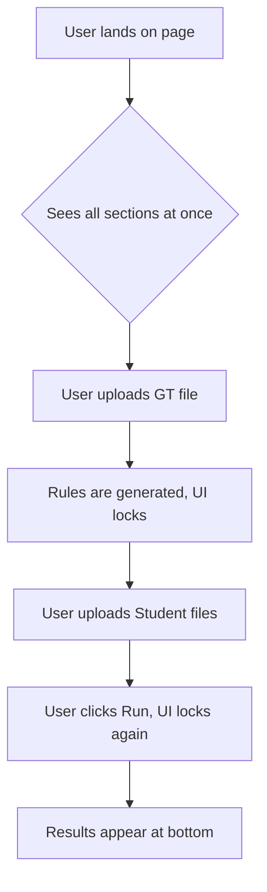
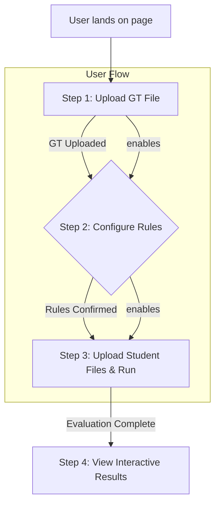
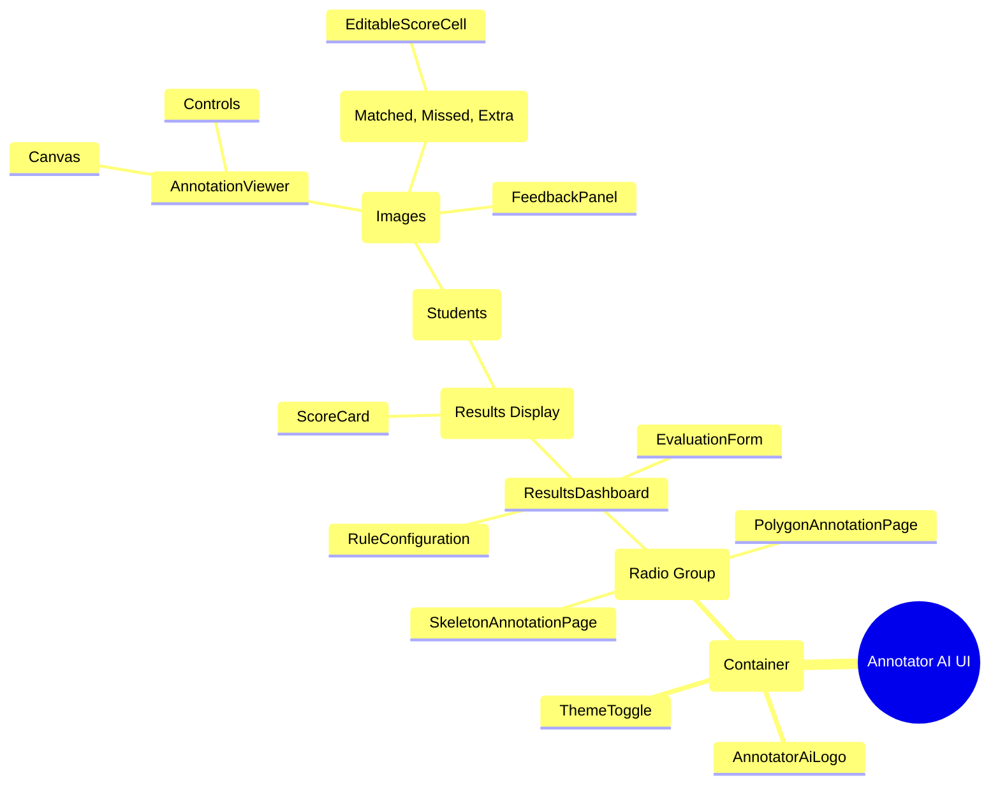

# Annotator AI: UI/UX Improvement Plan

**Document Version:** 1.0
**Date:** August 19, 2024
**Author:** AI Prototyper

---

## 1. Overview

### 1.1 Current Purpose of the UI

The primary purpose of the Annotator AI user interface is to provide a straightforward, in-browser platform for trainers to evaluate the quality of image annotations submitted by students. The UI facilitates a three-step workflow:

1.  **Upload:** Ingesting Ground Truth (GT) and student annotation files.
2.  **Configure:** Automatically generating and allowing modification of evaluation rules.
3.  **Review:** Displaying detailed, scorable results with visual feedback.

### 1.2 Target Users

The main user persona is the **Annotation Trainer** or **Quality Assurance (QA) Manager**. This user is technically competent but seeks to avoid the manual, time-consuming process of writing custom scripts for evaluation. They value efficiency, accuracy, and clear, actionable feedback.

### 1.3 Overall Theme & Design Language

The current design language, based on **ShadCN UI** and **Tailwind CSS**, projects a modern, clean, and professional aesthetic. The theme utilizes a neutral palette with a distinct brand personality, characterized by:
-   A custom font pairing (`Bangers` for headlines, `Karla` for body).
-   A "hard shadow" effect on cards and buttons, giving it a tactile, slightly retro feel.
-   A consistent and well-organized component system.

This plan aims to enhance usability **while preserving this established visual identity**.

---

## 2. Code & UI Analysis

An analysis of the existing React components reveals a functional but monolithic structure that presents several UI/UX challenges.

### 2.1 Current UI Structure & State Management

-   **Monolithic Core Component (`page.tsx`):** The main `page.tsx` component acts as a "god component," managing nearly all application state:
    -   File contents (GT, student, images).
    -   Evaluation rules (`evalSchema`).
    -   Loading and error states for multiple async operations.
    -   The final evaluation `results`.
    -   State for the interactive viewer (`selectedAnnotation`, `feedback`).
    -   Score overrides and `localStorage` logic.

-   **Component Breakdown:**
    -   `EvaluationForm.tsx`: Handles file inputs.
    -   `RuleConfiguration.tsx`: Manages the AI-driven rule generation and editing.
    -   `ResultsDashboard.tsx`: Displays the final results.
    -   `AnnotationViewer.tsx`: Provides the interactive visual comparison.

### 2.2 Usability Hindrances from Current Structure

-   **Lack of a Clear Workflow:** The UI presents all sections (Upload, Rules, Results) on one page. While simple, it doesn't guide the user through the required sequence of actions, which can be confusing for first-time users.
-   **Interdependent Loading States:** Because a single `isLoading` flag is used for both rule generation and evaluation, the UI can feel sluggish or unresponsive. For example, the entire form becomes disabled while rules are being generated, even though other sections are not directly involved.
-   **State Brittleness:** The centralized state in `page.tsx` means a small change or bug in one part of the app (e.g., file handling) can easily break another part (e.g., results display). This also leads to unnecessary re-renders of components that haven't changed.

---

## 3. Improvement Suggestions

The following suggestions aim to improve usability and workflow efficiency without altering the core visual theme.

### 3.1 Refined Layout & Workflow

The current single-page layout should be restructured to better guide the user.

-   **Suggestion:** Reorganize the `ResultsDashboard` into a more explicit, three-step process using accordions or distinct, numbered cards.
    1.  **Step 1: Upload Files:** Contains the `EvaluationForm`. This section is always enabled.
    2.  **Step 2: Configure Rules:** This section (`RuleConfiguration`) becomes active **only after** the GT file is successfully uploaded and parsed.
    3.  **Step 3: View Results:** This section is populated after the evaluation is run.

### 3.2 Component-Level Refinements

-   **`EvaluationForm.tsx`:**
    -   **Problem:** The form presents all file inputs at once, but they are sequential dependencies. A user could upload student files before a GT file, which is an invalid state.
    -   **Suggestion:** Make the "Student Annotations" and "Original Images" file inputs **disabled** until a GT file has been successfully uploaded. Provide a tooltip explaining why they are disabled.

-   **`ResultsDashboard.tsx`:**
    -   **Problem:** The dashboard can become very long and requires a lot of scrolling, especially with many students and images.
    -   **Suggestion:** Implement a two-tier accordion system. The top-level accordion is for each **student**. Inside each student's panel, have a nested accordion for each **image**, keeping the UI tidy and focused.

-   **`AnnotationViewer.tsx`:**
    -   **Problem:** The color legend is static.
    -   **Suggestion:** Make the legend interactive. Clicking on the "Missed" legend item should toggle the visibility of all missed annotations on the canvas, allowing users to focus on specific error types.

### 3.3 Accessibility Improvements

-   **Contrast:** The current `muted-foreground` color has low contrast on the `muted` background. Adjust the HSL values in `globals.css` to ensure all text meets WCAG AA standards.
-   **Keyboard Navigation:** Ensure all interactive elements (buttons, table rows, accordion triggers) are fully navigable and operable using the keyboard. Add `focus-visible` ring styles where they are missing.
-   **ARIA Attributes:** Add `aria-live` attributes to the results area so that screen readers announce when the evaluation is complete and results are available.

---

## 4. Workflow Enhancements

### 4.1 Current vs. Improved User Journey

**Current Journey:**


**Improved Journey:**


### 4.2 UI Wireframe Sketch (ASCII)

This sketch illustrates a more guided, card-based layout.

```
+-----------------------------------------------------------------+
| [Logo] Annotator AI                                [Theme Toggle] |
+-----------------------------------------------------------------+
|                                                                 |
|  +-----------------------------------------------------------+  |
|  | [1] Upload Ground Truth                                   |  |
|  | +-------------------------------------------------------+ |  |
|  | | (File Input for GT.zip)                             | |  |
|  | +-------------------------------------------------------+ |  |
|  +-----------------------------------------------------------+  |
|                                                                 |
|  +-----------------------------------------------------------+  |
|  | [2] Configure Rules (Disabled until GT is loaded)       |  |
|  | +-------------------------------------------------------+ |  |
|  | | [AI-generated schema and pseudocode appear here]    | |  |
|  | +-------------------------------------------------------+ |  |
|  +-----------------------------------------------------------+  |
|                                                                 |
|  +-----------------------------------------------------------+  |
|  | [3] Evaluate & Review (Disabled until rules are set)    |  |
|  | +-------------------------------------------------------+ |  |
|  | | (Student file inputs and 'Run' button appear here)   | |  |
|  | |                                                       | |  |
|  | | [Results dashboard populates this area]             | |  |
|  | +-------------------------------------------------------+ |  |
|  +-----------------------------------------------------------+  |
|                                                                 |
+-----------------------------------------------------------------+
```

---

## 5. Visual Aids

### 5.1 UI Component Mindmap



---

## 6. Future Ideas

These are long-term enhancements that build upon the improved foundation.

-   **Dark Mode:** The current `globals.css` file already includes a `.dark` theme structure. This should be fully implemented and tested to provide a first-class dark mode experience.
-   **Inline Feedback & Correction:** Instead of just viewing feedback, allow trainers to **correct an annotation directly in the `AnnotationViewer`**. This would involve adding drawing tools to the canvas, which would then update the annotation data and instantly recalculate the score. This is a powerful "human-in-the-loop" feature.
-   **AI-Assisted UX:**
    -   **Smart Defaults:** The AI could analyze the uploaded files and pre-select the most likely `toolType` (e.g., "COCO JSON").
    -   **Feedback Summarization:** For very large evaluations, a Genkit flow could summarize the most common errors across all students (e.g., "Note: 7 out of 10 students struggled to correctly label the 'occluded' attribute on pedestrians.").

By implementing the suggestions in this plan, Annotator AI can evolve from a functional tool into a highly intuitive and efficient platform that empowers trainers and accelerates the annotation quality assurance process.
