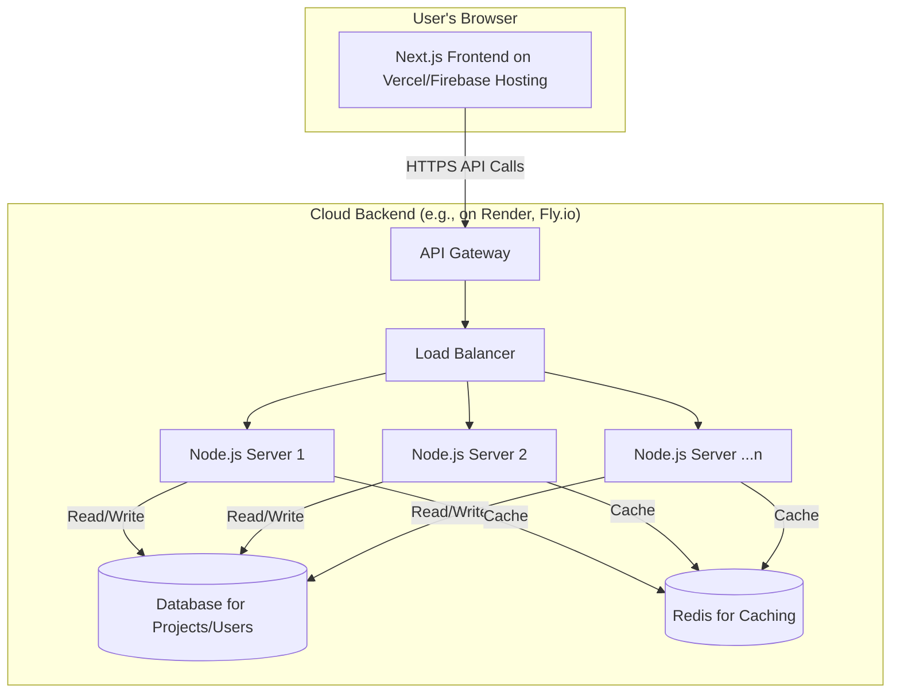

# Annotator AI: Strategic Improvement & Feature Roadmap

**Document Version:** 1.1
**Date:** August 17, 2024
**Authors:** Principal Product Strategist, Lead Software Architect

## 1. Executive Summary

Annotator AI has successfully established a strong foundation as an in-browser tool for annotation evaluation. Its primary value propositions—zero-cost hosting, data privacy, and ease of use for core formats—have been well-realized. The recent implementation of a **Web Worker** architecture and **Editable Scores** has significantly fortified the platform, addressing critical performance and usability issues.

This document outlines a comprehensive, multi-phased strategic plan to evolve Annotator AI from a powerful utility into a robust, scalable, and professional-grade platform. The roadmap is divided into two primary phases:

*   **Phase 1: Fortification & Enhancement (0-6 Months):** Focuses on addressing the remaining architectural weaknesses identified in our code review, such as monolithic state management and the lack of data persistence. The key objective is to stabilize the current platform, improve the developer experience, and add high-value features that build on the current architecture.

*   **Phase 2: Scalability & Expansion (6-24 Months):** Focuses on transitioning the core processing logic to a dedicated backend server, unlocking massive performance gains, enabling new classes of features (e.g., project management, collaboration), and establishing a robust CI/CD and testing pipeline. This phase will transform the tool into a true platform capable of handling enterprise-level workloads.

By executing this plan, we will not only rectify current weaknesses but also strategically position Annotator AI for long-term growth, user adoption, and community contribution.

---

## 2. Core Improvements

This section details critical enhancements to the existing application to address immediate bottlenecks related to performance, reliability, and usability. These are primarily **Phase 1** initiatives.

### 2.1. Centralize and Modularize State Logic

*   **Problem:** The `page.tsx` component is monolithic, managing all state, file handling, Web Worker communication, and UI logic. This makes it difficult to maintain, debug, and test.
*   **Severity:** **High**
*   **Solution Strategy:** Refactor the component by extracting self-contained logic into custom React hooks. This follows the principle of Separation of Concerns and is the next logical step after offloading computation to a worker.

#### **Proposed Hooks:**

1.  **`useFileHandler.ts`:**
    *   **Responsibility:** Manages all logic related to reading user-uploaded files (GT, student, images, ZIPs) and preparing them for the worker.
    *   **Exports:** `gtFileContent`, `studentFiles`, `imageUrls`, `handleGtFileChange`, `handleStudentFilesChange`, etc.

2.  **`useEvaluationManager.ts`:**
    *   **Responsibility:** Manages the entire evaluation lifecycle. It will instantiate and communicate with the `evaluation.worker.ts`.
    *   **Exports:** `results`, `isLoading`, `progress`, `runEvaluation`, `error`.

3.  **`useRuleManager.ts`:**
    *   **Responsibility:** Manages the state for the `evalSchema`, including fetching it from the Genkit flow and handling user modifications.
    *   **Exports:** `evalSchema`, `isGeneratingRules`, `handleRuleChange`.

4.  **`useScoreOverrides.ts`:**
    *   **Responsibility:** Encapsulates all logic for `localStorage` interaction, including saving and loading score overrides.
    *   **Exports:** `scoreOverrides`, `handleScoreOverride`, `recalculateResultsWithOverrides`.

*   **Success Metric:** Reduce the line count of `src/app/page.tsx` by at least 50%. Improve developer onboarding time for understanding a specific piece of logic (e.g., file handling) by 75%.

### 2.2. Implement Visual Progress Indicator
*   **Problem**: The Web Worker now sends `PROGRESS` messages, but the UI doesn't display this information visually. The user sees a generic "Evaluating..." state.
*   **Severity**: **Medium**
*   **Solution Strategy**: Create a `ProgressBar` component that visually represents the progress of the batch evaluation.

#### **Implementation Plan**:
1.  **Create a `Progress` state variable** in `page.tsx` (or the `useEvaluationManager` hook):
    ```typescript
    const [progress, setProgress] = useState<{ completed: number; total: number; currentFile: string; } | null>(null);
    ```
2.  **Update the worker message handler** to set this state when a `PROGRESS` message is received.
3.  **Create a `BatchProgress` component**:
    ```tsx
    // components/BatchProgress.tsx
    import { Progress } from "@/components/ui/progress";
    
    export function BatchProgress({ completed, total, currentFile }) {
      const percentage = total > 0 ? (completed / total) * 100 : 0;
      return (
        <div>
          <Progress value={percentage} className="w-full" />
          <p className="text-sm text-muted-foreground mt-2">
            Processing file {completed} of {total}: {currentFile}
          </p>
        </div>
      );
    }
    ```
4.  **Conditionally render** this component in `ResultsDashboard.tsx` when `isLoading` is true.
*   **Success Metric:** User satisfaction increases, and perceived wait time during batch evaluations decreases, as measured by user feedback.

---

## 3. New Feature Suggestions

This section outlines new features to expand the tool's capabilities, categorized by priority.

### 3.1. New Features Summary Table

| Feature ID | Feature Name                        | Description                                                               | Priority | Feasibility | Estimated Effort | Dependencies / Risks                                               |
| :--------- | :---------------------------------- | :------------------------------------------------------------------------ | :------- | :---------- | :--------------- | :----------------------------------------------------------------- |
| **NF-01**  | Project Persistence & History       | Save and load evaluation sessions using browser's `localStorage`/`IndexedDB`. | **High** | High        | Medium (Phase 1) | Requires careful state management to avoid data corruption.        |
| **NF-02**  | Advanced Skeleton Evaluation        | Support for custom keypoint connection templates and sigmas.              | **High** | Medium      | Medium (Phase 1) | UI for custom skeleton editor can be complex.                      |
| **NF-03**  | Rule Schema Export/Import           | Allow users to save and load their `EvalSchema` as a JSON file.         | **Medium** | High        | Low (Phase 1)    | Minimal risk.                                                      |
| **NF-04**  | AI-Assisted Scoring Fallback        | Use Genkit to score annotations if the rule-based engine fails.          | **Medium** | Medium      | Medium (Phase 1) | Dependent on third-party API costs and rate limits.                |
| **NF-05**  | Team-Based Projects & RBAC          | Full backend feature for collaborative projects with role-based access.     | **High** | High        | Large (Phase 2)  | **Hard Dependency**: Requires Phase 2 backend & NF-07 (Auth).      |
| **NF-06**  | Annotation Editor                   | Allow users to correct student annotations directly in the viewer.        | **Medium** | Medium      | Large (Phase 2)  | **Hard Dependency**: Requires Phase 2 backend for saving changes.  |
| **NF-07**  | Webhook & API Access                | Provide APIs for programmatic evaluation and webhooks for notifications. | **Low**    | High        | Large (Phase 2)  | **Hard Dependency**: Requires Phase 2 backend.                     |

### 3.2. Detailed Feature Descriptions

#### **NF-01: Project Persistence & History (High Priority)**

*   **Description:** Users frequently need to close their browser and return to an evaluation later. This feature will automatically save the current session (uploaded GT file, images, generated rules, and results) to the browser's storage. On revisiting the app, it will offer to restore the previous session.
*   **Rationale:** Drastically improves usability and prevents data loss from accidental page reloads or crashes. This is a standard feature for any serious productivity tool.
*   **Technical Feasibility:** High. `localStorage` is ideal for storing smaller data like the `evalSchema` and file handles (if using the File System Access API). `IndexedDB` is a robust client-side database perfect for storing larger blobs like the full `EvaluationResult[]` object.
*   **Implementation Sketch (using `IndexedDB`):**
    ```javascript
    // lib/storage.ts
    import { openDB } from 'idb';

    const dbPromise = openDB('annotator-ai-db', 1, {
      upgrade(db) {
        db.createObjectStore('sessions', { keyPath: 'id' });
      },
    });

    export async function saveSession(sessionData) {
      const db = await dbPromise;
      // Saves the entire state object under a single key.
      await db.put('sessions', sessionData, 'lastSession');
    }

    export async function loadLastSession() {
      const db = await dbPromise;
      return db.get('sessions', 'lastSession');
    }
    ```

#### **NF-02: Advanced Skeleton Evaluation (High Priority)**

*   **Description:** The current skeleton evaluation uses a hardcoded COCO template. This feature would allow users to define their own skeleton structures (e.g., for animals, custom robots) and provide custom OKS sigma values for each keypoint, which is critical for accurate evaluation in specialized domains.
*   **Rationale:** Unlocks the tool for a much wider range of pose estimation tasks beyond standard human pose.
*   **Technical Feasibility:** Medium. Requires UI work to create a simple editor for defining keypoint names and connections. The `evaluateSkeletons` function would need to be updated to accept this custom template as an argument.
*   **UI Sketch:** A simple table-based UI where a user can add rows for each keypoint (name, sigma value) and a visual connector tool to define the skeleton limbs.

---

## 4. User Experience (UX) Enhancements

Improvements focused on making the application more intuitive, efficient, and pleasant to use.

### 4.1. Guided Onboarding for First-Time Users

*   **Problem:** The multi-step workflow can be confusing for new users.
*   **Severity:** **Low**
*   **Solution:** Implement a guided tour using a library like **Shepherd.js** or **Driver.js**. The tour would activate on a user's first visit and walk them through the three main steps:
    1.  "Start by uploading your Ground Truth file here." (Highlights GT upload)
    2.  "Next, the AI will generate rules. You can edit them here." (Highlights Rule Configuration)
    3.  "Finally, upload student files and run the evaluation." (Highlights student upload and run button)
*   **Success Metric:** Reduce the "time-to-first-successful-evaluation" for new users by 50%.

### 4.2. State Preservation Across Evaluation Modes

*   **Problem:** Switching between "Bounding Box," "Polygon," and "Skeleton" modes currently resets the entire application state, losing uploaded files and configurations.
*   **Severity:** **High**
*   **Solution:** Lift the shared state (e.g., `gtFileContent`, `imageUrls`, `evalSchema`) to a higher-level context or component that persists across the mode switch. Instead of conditionally rendering the page components (which unmounts them), use CSS `display: none` to hide the inactive tabs, which will preserve their internal state.
*   **Success Metric:** Achieve 100% state preservation when switching between evaluation modes. A user can upload a file in one mode, switch to another, and switch back without losing their data.

### 4.3. Visual Feedback & Legend Improvements

*   **Problem:** The visual feedback for bounding box errors is powerful but could be clearer. The color legend is not always visible.
*   **Severity:** **Medium**
*   **Solution:**
    1.  **Interactive Legend:** Make the legend interactive. Clicking on "Missed" could toggle the visibility of all missed annotations, helping users de-clutter the view.
    2.  **Clearer Feedback Overlay:** When a `cut_off` or `gap` is displayed, add a subtle text label directly on the colored overlay indicating which it is.
    3.  **Color-Coded Tables:** The rows in the "Matched," "Missed," and "Extra" tables should use a left border color that matches the annotation color in the viewer, creating a stronger visual link.

#### **Mermaid Diagram: Improved User Workflow**

```mermaid
graph TD
    subgraph "Onboarding"
        A[First Visit] --> B{Show Guided Tour?};
        B -- Yes --> C[Step 1: Highlight GT Upload];
        C --> D[Step 2: Highlight Rule Config];
        D --> E[Step 3: Highlight Student Upload];
        E --> F[Start App];
        B -- No --> F;
    end

    subgraph "Core Loop"
        F --> G[Upload GT File];
        G --> H{State Persists};
        H --> I[Configure Rules];
        I --> H;
        H --> J[Switch Mode (e.g., to Polygon)];
        J --> H;
        H --> K[Upload Student Files];
        K --> L[Run Evaluation (in Worker)];
        L --> M{Show Progress Bar};
        M --> N[Display Interactive Results];
    end

    style B fill:#FFB347,stroke:#333,stroke-width:2px
    style J fill:#FFB347,stroke:#333,stroke-width:2px
```

---

## 5. Developer Experience (DX) Enhancements

Improving the development environment is key to attracting contributors and increasing maintenance velocity.

### 5.1. Implement a Comprehensive Testing Strategy

*   **Problem:** The project has zero automated test coverage, making refactoring risky and regressions likely.
*   **Severity:** **High**
*   **Solution:** Introduce a multi-layered testing strategy using **Vitest** (or Jest) and **React Testing Library**.
    1.  **Unit Tests:** For all pure logic in `src/lib/` and `src/workers/`. These are fast and easy to write.
        *   **Example (`evaluator.spec.ts`):**
          ```typescript
          import { calculateIoU, recalculateOverallScore } from './evaluator';
          import { describe, it, expect } from 'vitest';

          describe('calculateIoU', () => {
            it('should return 1 for identical boxes', () => {
              const box = [0, 0, 10, 10];
              expect(calculateIoU(box, box)).toBe(1);
            });
            it('should return 0 for non-overlapping boxes', () => {
              const boxA = [0, 0, 10, 10];
              const boxB = [20, 20, 10, 10];
              expect(calculateIoU(boxA, boxB)).toBe(0);
            });
          });

          describe('recalculateOverallScore', () => {
              // ... test cases for score overrides ...
          });
          ```
    2.  **Component Tests:** For key UI components like `RuleConfiguration` and `EditableScoreCell` to ensure they render correctly and handle user input.
    3.  **Integration Tests:** Test the interaction between components and hooks (e.g., does clicking "Run Evaluation" correctly call the `useEvaluationManager` hook and post a message to the worker?).

*   **Success Metric:** Achieve >80% test coverage for all utility and logic files. Achieve >70% coverage for critical UI components.

### 5.2. Establish a CI/CD Pipeline

*   **Problem:** No automated checks are run before merging code, risking the introduction of bugs or style inconsistencies into the `main` branch.
*   **Severity:** **High**
*   **Solution:** Implement a GitHub Actions workflow that runs on every pull request.
    *   **File:** `.github/workflows/ci.yml`
    *   **Jobs:**
        1.  **Lint & Format:** Run ESLint and Prettier to enforce code style.
        2.  **Type Check:** Run `npm run typecheck`.
        3.  **Test:** Run all unit and component tests with `npm test`.
        4.  **Build:** Run `npm run build` to ensure the project builds successfully.

#### **Example CI Workflow (`ci.yml`)**
```yaml
name: Annotator AI CI

on:
  push:
    branches: [ main ]
  pull_request:
    branches: [ main ]

jobs:
  build-and-test:
    runs-on: ubuntu-latest
    steps:
    - uses: actions/checkout@v4
    - name: Use Node.js
      uses: actions/setup-node@v4
      with:
        node-version: '20'
        cache: 'npm'
    - name: Install dependencies
      run: npm install
    - name: Run linter
      run: npm run lint
    - name: Run tests
      run: npm test
    - name: Check types
      run: npm run typecheck
    - name: Run build
      run: npm run build
```

### 5.3. Pin Dependencies

*   **Problem:** The use of `^` and `latest` in `package.json` can lead to non-deterministic builds where a new dependency version introduces breaking changes.
*   **Severity:** **Medium**
*   **Solution:** Pin all dependencies to exact versions. Use a dependency management bot like **Dependabot** or **Renovate** to automatically create PRs for dependency updates, allowing them to be tested by the new CI pipeline before being merged.
*   **Success Metric:** Ensure 100% reproducible builds from a fresh `npm install`.

---

## 6. Scalability & Performance Upgrades (Phase 2)

### The In-Browser Performance Ceiling

The improvements in Phase 1 will significantly enhance the current application. However, as identified in our architectural review, a browser-only model has fundamental limits on dataset size and processing power. To evolve Annotator AI from a utility into a truly professional-grade platform capable of handling enterprise workloads, a transition to a backend-for-frontend (BFF) architecture is essential. This phase represents the most important long-term investment in the project's future.

### 6.1. Transition to a Backend-for-Frontend (BFF) Architecture

*   **Problem:** The browser-only architecture has fundamental limits on dataset size and processing power, even with a Web Worker.
*   **Solution:** Introduce a dedicated Node.js (Express or Fastify) backend server to handle all heavy lifting. This is the **most important long-term upgrade** for the project.

#### **Architecture Diagram: Target State**



#### **Benefits:**

*   **Virtually Unlimited Scalability:** Can process datasets of any size, limited only by server resources, not the user's browser.
*   **Consistent Performance:** All users get the same fast experience, regardless of their local machine's power.
*   **Enables Advanced Features:** Required for collaborative projects, user accounts, and persistent storage.

### 6.2. Implement a Job Queue System

*   **Problem:** As the backend grows, some tasks (like evaluating a massive zip file) might take minutes. A simple HTTP request will time out.
*   **Solution:** Use a job queue system like **BullMQ** with **Redis**.
    1.  When a user uploads a large file, the API endpoint immediately returns a `202 Accepted` response with a `jobId`.
    2.  The job is added to the Redis queue.
    3.  A separate pool of backend workers picks up jobs from the queue and processes them.
    4.  The frontend polls an endpoint (`/api/jobs/{jobId}/status`) or uses WebSockets to get real-time updates and the final result.

*   **Success Metric:** Support for evaluation jobs that take up to 30 minutes to complete without HTTP timeouts.

---

## 7. Security & Compliance Features

### 7.1. Mitigate Client-Side API Key Risk

*   **Problem:** The current architecture exposes the `GEMINI_API_KEY` on the client side.
*   **Severity:** **High**
*   **Solution (Phase 1 - Mitigation):** Update the `README.md` with an urgent security warning and detailed instructions on how to restrict the API key in the Google Cloud Console using HTTP referrer restrictions. This is a temporary fix.
*   **Solution (Phase 2 - Permanent Fix):** Move all Genkit/Gemini API calls to the backend server. The key will be stored securely as a server-side environment variable, never exposed to the client.

### 7.2. Implement User Authentication (Phase 2)

*   **Description:** To support projects and collaboration, implement a robust authentication system.
*   **Recommendation:** Use a third-party service like **Clerk**, **Auth0**, or **Firebase Authentication**. This is more secure and faster to implement than building a system from scratch.
*   **Example (using Clerk with Next.js):**
    ```javascript
    // src/app/layout.tsx
    import { ClerkProvider } from '@clerk/nextjs';

    export default function RootLayout({ children }) {
      return (
        <ClerkProvider>
          <html lang="en">
            <body>{children}</body>
          </html>
        </ClerkProvider>
      );
    }
    ```

---

## 8. Integration Opportunities

### 8.1. Integrate with Cloud Storage

*   **Description:** Allow users to connect their AWS S3, Google Cloud Storage, or Azure Blob Storage accounts. Instead of uploading files directly, users can point the tool to a bucket/folder. The backend would then process the files directly from cloud storage.
*   **Rationale:** This is a standard workflow for professional data science and ML teams and would make the tool dramatically more useful for serious projects.

### 8.2. Integrate with Annotation Platforms

*   **Description:** Develop direct integrations with platforms like **Labelbox**, **CVAT (Cloud)**, or **Supervisely**. A user could authenticate with their account and directly pull a dataset for evaluation, then optionally push the results back.
*   **Rationale:** Reduces friction and positions Annotator AI as a key component in the MLOps ecosystem.

---

## 9. Metrics for Success

Defining and tracking KPIs is essential to measure the impact of these improvements.

| Area                    | KPI                                       | Current Baseline (Estimate) | Target (12 Months) | Measurement Tool        |
| :---------------------- | :---------------------------------------- | :-------------------------- | :----------------- | :---------------------- |
| **Performance**         | UI Freeze Time (50-file batch)            | < 100ms                     | < 100ms            | Browser Performance API |
| **Performance**         | P95 Evaluation Latency (Server)           | N/A                         | < 5 seconds        | Backend APM (Sentry)    |
| **Reliability**         | Weekly Production Bug Reports             | 1-2                         | < 0.5              | GitHub Issues           |
| **Developer Velocity**  | Average PR Merge Time                     | 3 days                      | < 1 day            | GitHub Metrics          |
| **Developer Quality**   | Test Coverage                             | 0%                          | 80%                | Vitest Coverage Report  |
| **User Adoption**       | Weekly Active Users                       | TBD                         | +200%              | Web Analytics (Vercel)  |
| **User Engagement**     | Session Restoration Rate                  | 0%                          | > 40%              | Custom Analytics Event  |

This roadmap provides a clear path forward. By focusing on fortification in the short term and strategic expansion in the long term, Annotator AI can grow into an indispensable tool for the computer vision community.
