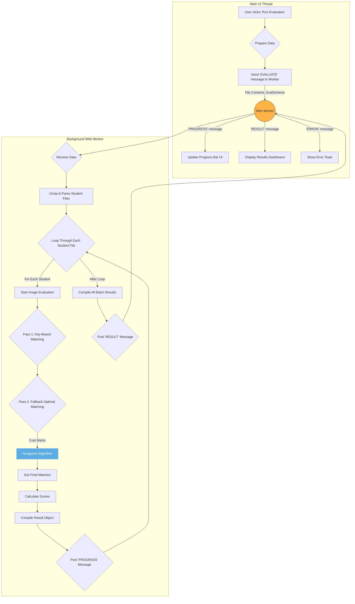

# Annotator AI: The Evaluation & Scoring Engine

This document provides a detailed technical explanation of the annotation matching and scoring algorithms used in Annotator AI. It covers the current two-pass system, the formulas used for scoring, and the rationale for replacing the previous "Greedy" algorithm.

---

## 1. The Current Evaluation Process

The new evaluation algorithm is designed to be both accurate and robust, handling simple cases efficiently while solving complex scenarios optimally. It operates in a **two-pass matching system** for each image being evaluated.

### Step-by-Step Process

1.  **Data Preparation**: For a given image, the system gathers all Ground Truth (GT) annotations and all student annotations.
2.  **Pass 1: Key-Based Matching (Deterministic)**
    - The system first checks if a `matchKey` (e.g., a unique ID like "Annotation No") was defined in the **Evaluation Rules**.
    - If a key exists, it attempts to find a one-to-one match between a GT annotation and a student annotation that share the exact same value for that key.
    - This is the most reliable matching method, as it's based on explicit identifiers. All annotations successfully paired in this pass are considered "matched" and are removed from the pool for the next pass.
3.  **Pass 2: Optimal Matching (Hungarian Algorithm Fallback)**
    - After Pass 1, some annotations may remain (e.g., if the student forgot an ID or if no `matchKey` was used).
    - For all remaining GT and student annotations, the system constructs a **cost matrix**. Each cell `(i, j)` in the matrix represents the "cost" of matching GT annotation `i` with student annotation `j`.
    - The cost is calculated as `1 - IoU(i, j)`. A perfect match (IoU = 1.0) has a cost of 0, while a non-overlapping match (IoU = 0.0) has a cost of 1. If the IoU is below a set threshold (e.g., 0.5), the cost is set to an extremely high number to effectively forbid the match.
    - The **Hungarian algorithm** (implemented via the `munkres-js` library) is then used to find the set of pairs with the minimum possible total cost. This guarantees the most optimal assignment of pairs, avoiding the pitfalls of the Greedy method.
4.  **Categorization**:
    - **Matched**: Any GT annotation that was successfully paired with a student annotation in either Pass 1 or Pass 2.
    - **Missed**: Any GT annotation that was left unpaired after both passes.
    - **Extra**: Any student annotation that was left unpaired after both passes.
5.  **Scoring**: Once all annotations are categorized, the system calculates scores for each matched pair and then aggregates them into an overall submission score.

---

## 2. Scoring Method

The scoring system is designed to provide a holistic view of annotation quality, balancing localization, classification, and attribute accuracy.

### Individual Match Score

For each `Matched` pair, an **Original Score** (0-100) is calculated using a weighted formula:

`Match Score = (IoU * 70) + (Label_Score * 15) + (Attribute_Score * 15)`

-   **IoU (70% weight)**: The raw Intersection over Union value, scaled. A perfect overlap (IoU=1.0) contributes 70 points.
-   **Label Score (15% weight)**: A binary score. If the class labels match (e.g., 'car' == 'car'), this is 100, contributing 15 points. If they don't, it's 0.
-   **Attribute Score (15% weight)**: The average similarity of all defined attributes for that label (e.g., 'color', 'occluded'), calculated using Levenshtein distance for string comparison. An average similarity of 100% contributes 15 points.

### Trainer Overrides

Trainers can manually edit the score for any matched annotation.

-   The system stores the `originalScore` (calculated by the formula) and an optional `overrideScore`.
-   If `overrideScore` exists, it is used as the **Final Score** for that specific match in all subsequent calculations.
-   This ensures that the trainer's expert judgment is the final source of truth.

### Overall Submission Score

The final grade for the entire submission is a 50/50 blend of **quality** and **completeness**:

`Overall Score = (Avg_Match_Quality * 0.5) + (F-beta_Score * 0.5)`

-   **Average Match Quality (50% weight)**: This is the simple average of all **Final Scores** (including overrides) for every matched annotation. It answers the question: "How good was the work the student actually did?"
-   **F-beta Score (50% weight)**: This is a standard industry metric that balances precision and recall to measure completeness. It penalizes for missed and extra annotations. We use a beta value of 0.5, which weighs **precision higher than recall**, discouraging users from "guessing" by creating many low-quality annotations.
    -   `Precision = Matched / (Matched + Extra)`
    -   `Recall = Matched / (Matched + Missed)`

---

## 3. Comparison with Previous Algorithm (Greedy)

The initial version of the tool used a simpler, but flawed, "Greedy" matching algorithm.

### The Old Greedy Algorithm

The Greedy algorithm worked as follows:
1.  For the first GT annotation, it would loop through *all* student annotations.
2.  It would find the student annotation with the highest IoU, and if that IoU was above the threshold, it would declare it a match.
3.  That student annotation would be removed from the pool.
4.  It would then move to the second GT annotation and repeat the process with the *remaining* student annotations.

### Why It Was Replaced

The Greedy algorithm can lead to sub-optimal pairings. Consider this scenario:

-   **GT_1** has a high IoU of **0.9** with **Student_A**.
-   **GT_1** also has a decent IoU of **0.7** with **Student_B**.
-   **GT_2** has a poor IoU of **0.2** with **Student_A**.
-   **GT_2** has a high IoU of **0.95** with **Student_B**.

The Greedy algorithm, starting with `GT_1`, would instantly pair it with `Student_A` because 0.9 is the highest IoU. This leaves `Student_B` for `GT_2`. The final pairings would be:
-   `(GT_1, Student_A)` -> IoU = 0.9
-   `(GT_2, Student_B)` -> IoU = 0.95
-   **Problem**: This seems fine, but what if `Student_A` was actually a poor match for `GT_1` and an even worse match for `GT_2`? The Hungarian algorithm considers the *entire system* and finds the best global solution.

---

## 4. Reason for the Change

The Hungarian algorithm was chosen because it guarantees the **mathematically optimal assignment** of GT annotations to student annotations.

-   **Solves the Greedy Problem**: It avoids scenarios where an early, "good enough" match prevents a later, much better match from being made. It looks at the entire cost matrix and finds the pairings that minimize the total cost (i.e., maximize the total IoU) across all possible assignments.
-   **Increases Accuracy**: The final set of matches is more reliable and better reflects the true alignment between the ground truth and the student's work.
-   **Robustness**: It provides a solid foundation for fair and accurate scoring, which is critical for the tool's credibility.

---

## 5. New Evaluation Flow Chart

This diagram illustrates the current, more robust evaluation process.

