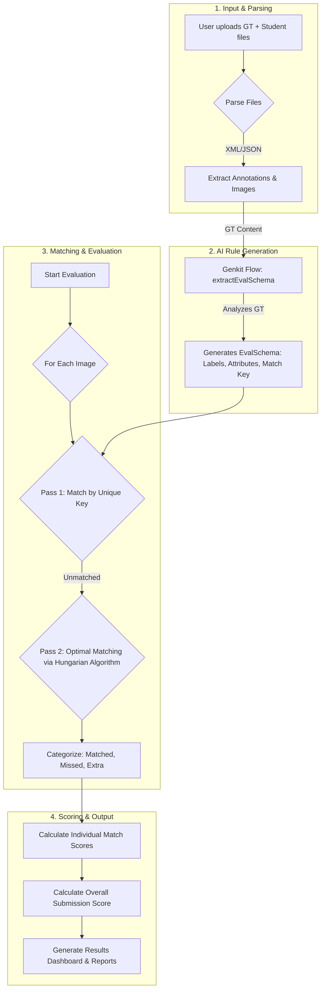
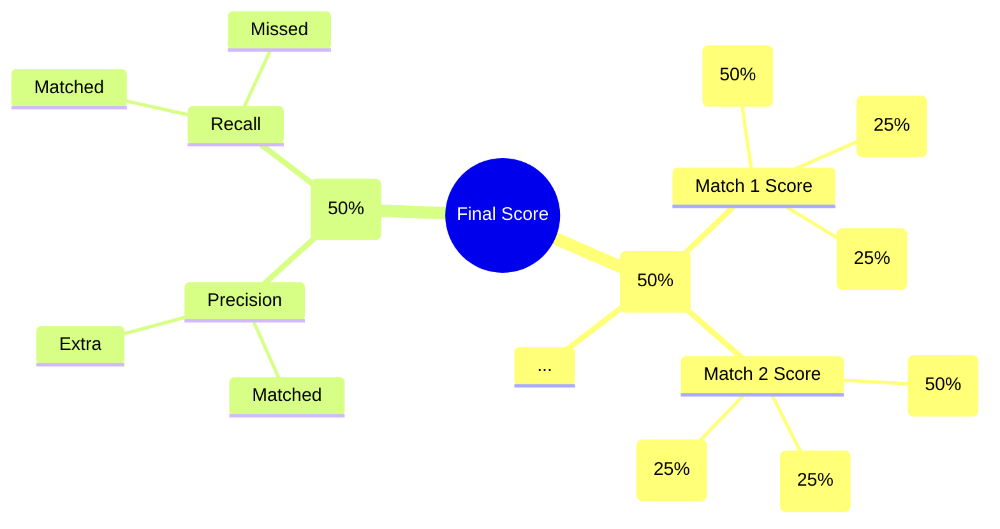

# Annotator AI: Scoring Plan & Methodology

**Version:** 1.0
**Date:** August 19, 2024

---

## 1. Overview

### 1.1 Purpose of the Scoring System

The primary goal of the Annotator AI scoring system is to provide a **fair, transparent, and comprehensive evaluation** of annotation quality. It is designed to move beyond simple metrics and give trainers a nuanced understanding of a student's performance by assessing not just the accuracy of the annotations but also their completeness.

This system helps trainers:
-   Quickly identify high-performing annotators.
-   Pinpoint specific areas of weakness for students who need more guidance.
-   Ensure consistent and objective grading across large batches of submissions.

### 1.2 Supported Annotation Types

The scoring engine is built to support a variety of common computer vision annotation tasks:
-   **Bounding Boxes:** For object detection.
-   **Polygons:** For precise instance segmentation.
-   **Skeletons/Keypoints:** For pose estimation.
-   **Attributes:** Text or class-based metadata attached to any annotation (e.g., color, occlusion status, text content).

---

## 2. Data Flow & Processing

The evaluation process begins when a trainer uploads a Ground Truth file and one or more student submission files.

### 2.1 Inputs

-   **Ground Truth (GT) File:** A single file representing the "correct" annotations, reviewed by an expert.
-   **Student/Prediction Files:** One or more files containing the annotations produced by students or a model.
-   **Image Files:** The original images corresponding to the annotations. These can be bundled in a ZIP archive with the GT file or uploaded separately.

### 2.2 Input Structure Examples

The tool primarily accepts COCO (JSON) and CVAT (XML) formats.

**COCO JSON (Simplified Example):**
```json
{
  "images": [{"id": 1, "file_name": "image1.jpg", "width": 800, "height": 600}],
  "annotations": [{
    "id": 101,
    "image_id": 1,
    "category_id": 1,
    "bbox": [100, 150, 50, 75],
    "attributes": {"color": "red"}
  }],
  "categories": [{"id": 1, "name": "Car"}]
}
```

**CVAT XML (Simplified Example):**
```xml
<annotations>
  <image id="0" name="image1.jpg" width="800" height="600">
    <box label="Car" xtl="100" ytl="150" xbr="150" ybr="225">
      <attribute name="color">red</attribute>
    </box>
  </image>
</annotations>
```

### 2.3 Processing Workflow

The system follows a multi-stage process to generate the final scores.



---

## 3. Scoring Logic

The core of the evaluation lies in a robust two-pass matching system followed by a multi-faceted scoring calculation.

### 3.1 The Matching Process

For each image, the system intelligently pairs Ground Truth annotations with Student annotations.

**Pass 1: Key-Based Matching (Deterministic)**
- The system first checks if a unique identifier (e.g., `Annotation No`) was specified as a `matchKey` in the evaluation rules.
- If so, it performs a direct, one-to-one match for any GT and student annotations that share the same key value. This is the most reliable form of matching.
- Matched pairs are removed from the pool for the next pass.

**Pass 2: Optimal Assignment (Hungarian Algorithm)**
- For all annotations that remain unmatched, the system calculates a **cost matrix** where each cell represents the "cost" of matching a GT annotation with a student annotation.
- The cost is `1 - IoU`. A perfect overlap (IoU = 1.0) has a cost of 0.
- The **Hungarian algorithm** is then used to find the set of pairs with the *minimum possible total cost*. This guarantees the most optimal assignment globally, avoiding common pitfalls of simpler "greedy" matching algorithms.

**Categorization:**
- **Matched:** A GT annotation successfully paired with a student annotation.
- **Missed:** A GT annotation that could not be paired.
- **Extra:** A student annotation that could not be paired.

### 3.2 Individual Score Components

For every **Matched** pair, the system assesses three different aspects of quality:

1.  **Localization Accuracy (IoU/OKS):**
    -   For **Bounding Boxes & Polygons**, this is the **Intersection over Union (IoU)**, which measures the percentage of overlap between the GT and student shapes.
    -   For **Skeletons**, this is the **Object Keypoint Similarity (OKS)**, which measures the proximity of corresponding keypoints, scaled by the object's size.

2.  **Label Accuracy:**
    -   The system compares the primary class label of the GT annotation (e.g., "Car") with the student's label.
    -   It uses a string similarity algorithm (Levenshtein distance) to be resilient to minor typos (e.g., "car" vs. "Car").

3.  **Attribute Accuracy:**
    -   The system checks all other relevant attributes defined in the evaluation rules (e.g., `color`, `occluded`).
    -   Each attribute's value is compared using string similarity. The final attribute score is the average similarity across all checked attributes.

---

## 4. Score Calculation

The final score is a carefully balanced blend of quality and completeness.

### 4.1 Individual Match Score

The score for a single matched annotation pair is calculated using a weighted formula:

`Match Score = (Localization_Score * 0.50) + (Label_Score * 0.25) + (Attribute_Score * 0.25)`

-   **Localization_Score:** The raw IoU or OKS value, scaled to 100.
-   **Label_Score:** The string similarity of the labels, scaled to 100.
-   **Attribute_Score:** The average string similarity of the attributes, scaled to 100.

This 50/25/25 weighting ensures that while geometric accuracy (IoU) is the most important factor, significant mistakes in either the label or the attributes will result in a substantial and noticeable penalty to the score for that specific match.

### 4.2 Overall Submission Score

The final grade for an entire student submission is a 50/50 blend of two key metrics:

`Overall Score = (Average_Match_Quality * 0.5) + (Completeness_Score * 0.5)`

-   **Average Match Quality (50%):** The average of all individual `Match Score` values. This answers: *"How well did the student annotate the items they found?"*
-   **Completeness Score (F-beta Score, 50%):** A score that balances precision and recall to measure completeness. This answers: *"Did the student find everything they were supposed to, without adding extra annotations?"*
    -   `Precision = Matched / (Matched + Extra)`
    -   `Recall = Matched / (Matched + Missed)`
    -   The `beta` value is set to **0.5**, which weighs precision more heavily than recall. This is a deliberate choice to discourage students from guessing or creating many low-quality annotations.

---

## 5. Scoring Example

Let's walk through an example for a single image evaluation.

-   **Ground Truth:** Contains 3 objects to be annotated.
-   **Student Submission:** The student correctly matches 2 objects, misses 1, and adds 1 extra annotation that wasn't in the GT.

### Step 1: Calculate Individual Match Scores

**Match 1:**
-   IoU: `0.95` (Localization Score = 95)
-   Label: "Car" vs "Car" (Label Score = 100)
-   Attribute `color`: "red" vs "red" (Attribute Score = 100)
-   **Match 1 Score** = `(95 * 0.5) + (100 * 0.25) + (100 * 0.25)` = `47.5 + 25 + 25` = **97.5**

**Match 2:**
-   IoU: `0.92` (Localization Score = 92)
-   Label: "Person" vs "persn" (Label Score = 83 due to typo)
-   Attribute `occluded`: "true" vs "false" (Attribute Score = 0)
-   **Match 2 Score** = `(92 * 0.5) + (83 * 0.25) + (0 * 0.25)` = `46 + 20.75 + 0` = **66.75**

### Step 2: Calculate Average Match Quality

-   `Avg_Match_Quality` = `(97.5 + 66.75) / 2` = **82.13**

### Step 3: Calculate F-beta Score (Completeness)

-   Matched = 2, Missed = 1, Extra = 1
-   `Precision` = `2 / (2 + 1)` = 0.667
-   `Recall` = `2 / (2 + 1)` = 0.667
-   `F-beta_Score` = `(1 + 0.5²) * (0.667 * 0.667) / ((0.5² * 0.667) + 0.667)` = `0.555 / 0.834` = 0.665
-   Scaled to 100, the **F-beta Score** is **66.5**.

### Step 4: Calculate Final Overall Score

-   `Overall Score` = `(82.13 * 0.5) + (66.5 * 0.5)`
-   `Overall Score` = `41.07 + 33.25` = **74.32**
-   The student's final rounded score for this submission is **74**.

---

## 6. Visual Aids

### 6.1 Scoring Flow Mindmap

This mindmap illustrates the components that contribute to the final score.



---

## 7. Common Mistakes & Explanations

-   **"Why is my score low if my boxes were almost perfect?"**
    -   Your **Average Match Quality** might be high, but a low **Completeness Score** is likely pulling down your final grade. This happens if you miss several required annotations or add many extra ones.
-   **"I got the label wrong but my score only dropped a little."**
    -   This is by design. The weighted system correctly penalizes the label mistake (25% weight) but still gives you significant credit for the high-quality box placement (50% weight).
-   **"Why are scores for two students so different if their IoU is similar?"**
    -   Check the `Label Accuracy` and `Attribute Accuracy` columns. One student may have made more mistakes in these areas. Additionally, check the `missed` and `extra` counts, as this heavily impacts the F-beta (completeness) part of the score.

---

## 8. Future Improvements

-   **AI-Driven Feedback:** In the future, a Genkit flow could be used to analyze the specific errors (e.g., consistent gaps on the right side of boxes) and provide natural language feedback to the student, such as: "Good work on finding all the objects, but be careful to fully enclose them on the right side."
-   **Customizable Weights:** A future version could allow trainers to adjust the weights (e.g., make attribute accuracy more or less important) to better suit the specific goals of their training task.
